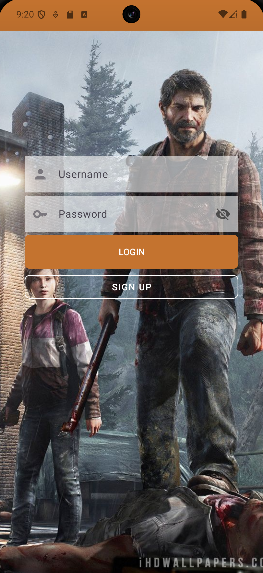
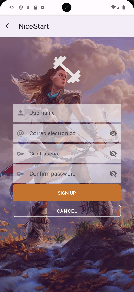
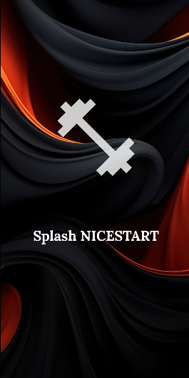
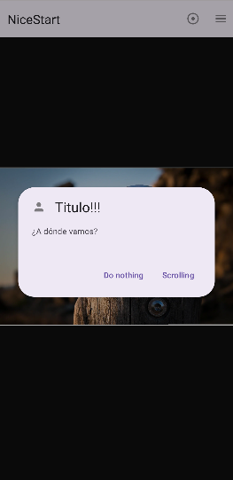
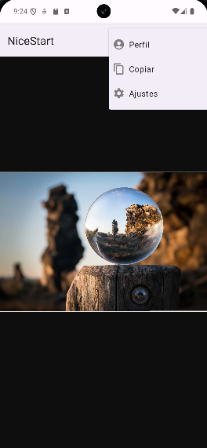

# Nicestart

## Descripción del Proyecto
Nicestart es una aplicación Android simple que incluye tres pantallas principales: Login, Registro y una pantalla Main. El propósito del proyecto es ofrecer un ejemplo básico de navegación entre actividades, manejo de temas y estilos, y la integración con Git para controlar versiones.

El proyecto también está organizado en ramas.

## Su funcionamiento

### Pantalla de Login

Permite a los usuarios ingresar sus credenciales de inicio de sesión.
- Contiene campos de texto para el usuario y la contraseña, así como un botón para iniciar sesión.

### Pantalla de Registro

Permite a los usuarios crear una nueva cuenta.
- Incluye campos para el nombre de usuario, correo electrónico y contraseña.
- Contiene botones para registrarse y volver a la pantalla de login.

### Pantalla Principal (Main)

Se accede entrando desde el login, o bien desde la pantalla de Sign Up.
- No permite regresar a la pantalla de Login.

### Pantalla Splash

Se trata de una interfaz donde el propio logo parpadea, dándole una animación sencilla.

### Menú 1: Ventana

Es un primer menú que abrirá una ventana emergente. Entre las 2 opciones, si damos a "Scrolling", nos enviará a otra pantalla (en este momento de vuelta al Login).

### Menú 2: Perfil, ajustes y copiar

El 2º menú nos da a elegir 3 opciones.
- Primera opción: Perfil. Si clicamos nos enviará a la pantalla "Profile"
- Segunda y tercera opción: Ajustes y Copiar: Al clicar nos pone un mensaje emergente en la parte inferior.

### Pantalla Profile

Esta pantalla muestra la foto de perfil de manera circular, nombre, descripción y correo.

Actualizaciones más adelante

