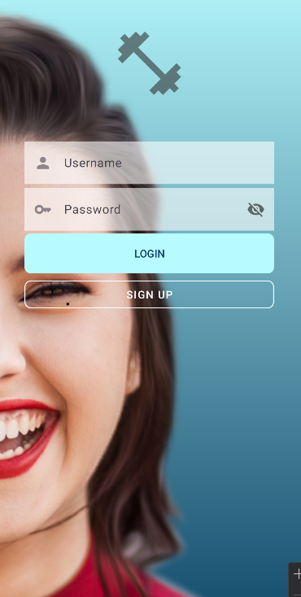
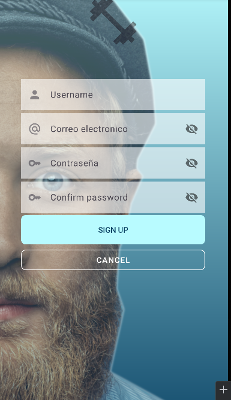

# Nicestart

## Descripción del Proyecto
**Nicestart** es una aplicación Android simple que incluye tres pantallas principales: **Login**, **Registro** y una pantalla **Main**. El propósito del proyecto es ofrecer un ejemplo básico de navegación entre actividades, manejo de temas y estilos, y la integración con Git para controlar versiones.

El proyecto también está organizado en ramas

## Como funciona
1. **Pantalla de Login**: Permite a los usuarios ingresar sus credenciales de inicio de sesión
    - No contiene barra de acción (ActionBar)
    - Contiene campos de texto para el usuario y la contraseña, así como un botón para iniciar sesión
      

2. **Pantalla de Registro**: Permite a los usuarios crear una nueva cuenta
    - Incluye campos para el nombre de usuario, correo electrónico y contraseña
    - Contiene botones para registrarse y regresar a la pantalla de login
      
3. **Pantalla Principal (Main)**: Es la pantalla a la que se redirige después de un login
    - Contiene una barra de acción (ActionBar)
    - No permite regresar a la pantalla de Login
